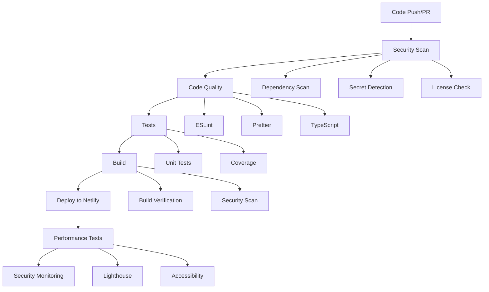

# CI/CD Pipeline Documentation

This document provides comprehensive information about the CI/CD pipeline setup for the Osinachi Renewables project.

## Overview

Our CI/CD pipeline is built with **GitHub Actions** and includes multiple layers of security, quality, and performance checks. The pipeline automatically runs on every push and pull request, ensuring code quality and security before deployment.

## Pipeline Architecture



## Workflows

### 1. Main CI/CD Pipeline (`.github/workflows/ci-cd.yml`)

**Triggers:**
- Push to `main` or `develop` branches
- Pull requests to `main` or `develop`
- Daily scheduled runs at 2 AM UTC

**Jobs:**

#### Security Scan
- **NPM Audit**: Scans for known vulnerabilities in dependencies
- **Snyk Security Scan**: Advanced vulnerability detection
- **Secret Detection**: Uses TruffleHog to scan for exposed secrets
- **CodeQL Analysis**: Static code analysis for security issues

#### Code Quality
- **ESLint**: Linting with security rules enabled
- **Prettier**: Code formatting verification
- **TypeScript**: Type checking
- **Commit Message Validation**: Enforces conventional commit format

#### Tests
- **Unit Tests**: Runs on Node.js 18 and 20
- **Coverage**: Generates and uploads coverage reports to Codecov

#### Build & Deploy
- **Application Build**: Creates production build
- **Build Security Scan**: Scans build output for sensitive data
- **Netlify Deployment**: Deploys to production (main branch only)
- **Post-deployment Verification**: Checks deployment accessibility

#### Performance Testing
- **Lighthouse CI**: Tests performance, accessibility, SEO, and PWA metrics
- **Multi-page Testing**: Tests key pages of the application

### 2. Security Scan Workflow (`.github/workflows/security-scan.yml`)

**Triggers:**
- Daily at 3 AM UTC
- Manual trigger via GitHub UI

**Features:**
- Comprehensive dependency vulnerability scanning
- Advanced secret detection across git history
- License compliance checking
- Automated security report generation

### 3. Branch Protection (`.github/workflows/branch-protection.yml`)

**Triggers:**
- Pull requests to `main` or `develop`

**Checks:**
- Commit message validation
- Secret scanning in PR changes
- Large file detection
- Package.json security validation
- Code quality verification
- Build verification
- Dependency security audit

## Security Features

### Dependency Management
- **Automated Updates**: Dependabot configured for weekly updates
- **Security-first**: Prioritizes security patches
- **Grouped Updates**: Related dependencies updated together
- **Version Control**: Ignores major version updates for stability

### Secret Protection
- **Pre-commit Scanning**: Prevents secrets from being committed
- **Historical Scanning**: Checks entire git history
- **Pattern Detection**: Multiple secret patterns detected
- **Build Output Scanning**: Ensures no secrets in production builds

### Code Security
- **ESLint Security Rules**: Detects common security issues
- **Object Injection Protection**: Prevents prototype pollution
- **Regex Safety**: Detects unsafe regular expressions
- **Input Validation**: Ensures proper input sanitization

## Local Development

### Running CI Checks Locally

```bash
# Run all CI checks locally
npm run ci:local

# Run specific checks
npm run security:scan
npm run lint
npm run test:run
npm run build:netlify
```

### Pre-commit Hooks

Pre-commit hooks are automatically installed via Husky:

```bash
# Install hooks (runs automatically after npm install)
npm run prepare

# Manual hook installation
npx husky install
```

**Pre-commit checks:**
- Code formatting (Prettier)
- Linting (ESLint)
- Type checking (TypeScript)
- Basic security scanning

### Commit Message Format

We use **Conventional Commits** format:

```
type(scope): description

Examples:
feat(auth): add user authentication
fix(ui): resolve navigation menu issue
docs(readme): update installation instructions
security(deps): update vulnerable dependencies
```

**Types:**
- `feat`: New features
- `fix`: Bug fixes
- `docs`: Documentation changes
- `style`: Code style changes
- `refactor`: Code refactoring
- `test`: Test-related changes
- `security`: Security improvements
- `deps`: Dependency updates
- `ci`: CI/CD changes

## Environment Setup

### Required Secrets

Configure these secrets in your GitHub repository:

```bash
# Netlify deployment
NETLIFY_SITE_ID=your-netlify-site-id
NETLIFY_AUTH_TOKEN=your-netlify-auth-token

# Security scanning
SNYK_TOKEN=your-snyk-token

# Code coverage
CODECOV_TOKEN=your-codecov-token
```

### Development Environment Variables

```bash
# Copy example environment file
cp env.example .env

# Required for local development
SESSION_SECRET=your-session-secret
ADMIN_TOKEN=your-admin-token
```

## Performance Monitoring

### Lighthouse CI Configuration

Located in `lighthouserc.json`:

```json
{
  "ci": {
    "collect": {
      "numberOfRuns": 3,
      "settings": {
        "chromeFlags": "--no-sandbox --disable-dev-shm-usage"
      }
    },
    "assert": {
      "assertions": {
        "categories:performance": ["warn", {"minScore": 0.8}],
        "categories:accessibility": ["error", {"minScore": 0.9}],
        "categories:best-practices": ["warn", {"minScore": 0.8}],
        "categories:seo": ["warn", {"minScore": 0.8}],
        "categories:pwa": ["warn", {"minScore": 0.7}]
      }
    }
  }
}
```

### Performance Thresholds

- **Performance**: 80% minimum (warning)
- **Accessibility**: 90% minimum (error)
- **Best Practices**: 80% minimum (warning)
- **SEO**: 80% minimum (warning)
- **PWA**: 70% minimum (warning)

## Troubleshooting

### Common Issues

#### 1. Build Failures

```bash
# Check build locally
npm run build:netlify

# Common fixes
npm ci --legacy-peer-deps
npm run format
npm run lint:fix
```

#### 2. Test Failures

```bash
# Run tests locally
npm run test:run

# Run tests in watch mode
npm run test

# Check test coverage
npm run test:coverage
```

#### 3. Security Scan Failures

```bash
# Check for vulnerabilities
npm audit

# Fix automatically fixable issues
npm audit fix

# Check for secrets
npm run security:scan
```

#### 4. Deployment Issues

- Verify Netlify secrets are configured
- Check build output in `client/dist`
- Ensure no sensitive data in build files

### Debug Mode

Enable debug mode for workflows:

```yaml
# Add to workflow file
env:
  ACTIONS_STEP_DEBUG: true
  ACTIONS_RUNNER_DEBUG: true
```

## Best Practices

### Development Workflow

1. **Create Feature Branch**
   ```bash
   git checkout -b feature/your-feature-name
   ```

2. **Make Changes**
   - Follow conventional commit format
   - Run local CI checks before pushing
   - Ensure tests pass

3. **Push Changes**
   ```bash
   git push origin feature/your-feature-name
   ```

4. **Create Pull Request**
   - All CI checks must pass
   - Require code review
   - Squash and merge

### Security Guidelines

1. **Never commit secrets**
   - Use environment variables
   - Add sensitive files to `.gitignore`
   - Use the secret scanning tools

2. **Keep dependencies updated**
   - Review Dependabot PRs regularly
   - Test updates thoroughly
   - Monitor security advisories

3. **Follow secure coding practices**
   - Validate all inputs
   - Use parameterized queries
   - Implement proper error handling
   - Follow OWASP guidelines

### Performance Optimization

1. **Monitor bundle size**
   - Keep build size under 10MB
   - Use code splitting
   - Optimize images and assets

2. **Lighthouse scores**
   - Maintain high performance scores
   - Ensure accessibility compliance
   - Follow SEO best practices

## Monitoring and Alerts

### GitHub Actions

- **Workflow Status**: Monitor in GitHub Actions tab
- **Email Notifications**: Configure in GitHub settings
- **Slack Integration**: Set up webhook notifications

### External Services

- **Netlify**: Deployment status and performance
- **Codecov**: Code coverage reports
- **Snyk**: Security vulnerability alerts

## Contributing

### Adding New Checks

1. **Update Workflow Files**
   - Add new jobs or steps
   - Follow existing patterns
   - Test thoroughly

2. **Update Documentation**
   - Document new checks
   - Update troubleshooting guide
   - Add examples

3. **Test Locally**
   - Update local CI script
   - Verify all checks work
   - Test edge cases

### Modifying Security Rules

1. **ESLint Configuration**
   - Update `eslint.config.js`
   - Test with existing codebase
   - Document rule changes

2. **Security Scanning**
   - Update workflow configurations
   - Test with sample vulnerabilities
   - Verify alert mechanisms

## Support

For issues with the CI/CD pipeline:

1. **Check workflow logs** in GitHub Actions
2. **Run local CI checks** to reproduce issues
3. **Review documentation** for common solutions
4. **Contact the development team** for complex issues

---

**Last Updated**: December 2024
**Version**: 1.0.0 